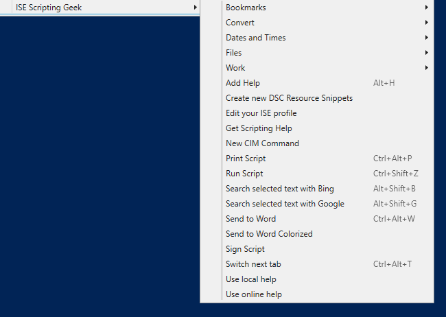
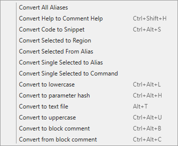
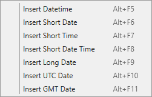

# ISEScriptingGeek Module

[](https://www.powershellgallery.com/packages/ISEScriptingGeek/) [](https://www.powershellgallery.com/packages/ISEScriptingGeek/)

This module is a set of PowerShell ISE add-ons and a few themes. It requires PowerShell 5.1.

_As of February 2019, I no longer intend to update or extend this module. VS Code is Microsoft's choice for a scripting editor going forward. The PowerShell ISE isn't going away any time soon, but it is also no longer under active development so I need no point in continuing to develop this module. I will maintain it and address pull requests should members of the community wish to contribute, maintain or extend this module._

Install the module from the PowerShell Gallery.

```powershell
Install-Module ISEScriptingGeek
```

Then in your PowerShell_ISE profile script, import the module.

```powershell
Import-Module ISEScriptingGeek
```

This will add shortcuts to the Add-Ons menu.

## Themes

The themes can be found and imported from the Themes sub-folder of the module.
These are optional and are not connected to the add-ons.

## Add-ons

Once the module is imported, the add-ons will be listed under **ISE Scripting Geek** on the **Add-ons** menu in the ISE.
A number of the add-ons fall into grouped sub-folders:



### Bookmarks

A set of functions for creating and working with "bookmarks" to files opened in the ISE.

### Convert

The module will add shortcuts to code that will perform conversions on the file or selected text.



### Dates and times

A set of functions for inserting date/time in different formats.



### Files

A set of functions for working with open files and their associated folders


### Work

A set of functions for creating and managing a "work list" of files

### Miscellaneous

There are also other scripts directly off the **ISE Scripting Geek** menu, these functions provide various capabilities:

- Print, Run, or Sign a script
- Send the script to Word (with or without color)
- Send selected text to different search engines
- Help functions
- New CIM Command, DSC Resource snippets, etc.

## Other Modules of Interest

You might also be interested in these modules:

- [ISERemoteTab](https://github.com/jdhitsolutions/New-ISERemoteTab)
- [PSScriptTools](https://github.com/jdhitsolutions/PSScriptTools)
